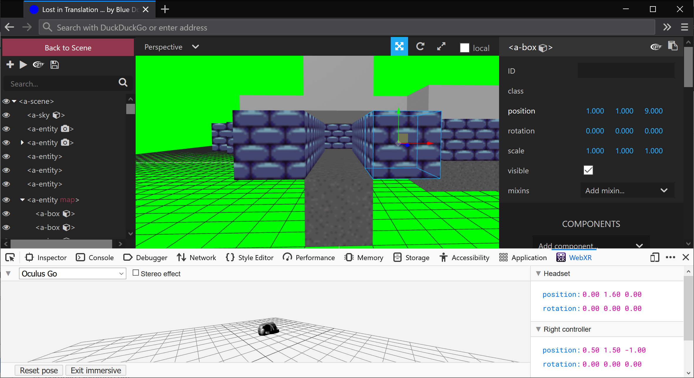

# Lost in Translation

*International XR Workshop 2021 demo*

In this VR game, two players -- one in a VR headset and one in physical reality -- must communicate effectively to reach the end of a series of maze-like levels. The 'reality-based' player has a map for directions; the VR-player relies on the map-holder to provide directions.

[live demo](https://lit.cmp.ac.nz/)

A WebXR game made with A-Frame. Showcased at [International XR Workshop 2021](https://sites.google.com/view/xrworkshop/home), 9-12 February @ School of Design, University of Auckland, New Zealand

  
*Work-in-progress screenshot*

# useful resources

* A-Frame is a three.js framework that adopts an Entity-Component-System (ECS) architecture:
  * (a well-known game engine implementing ECS is Unity)
  * https://en.wikipedia.org/wiki/Entity%E2%80%93component%E2%80%93system
  * http://t-machine.org/index.php/2007/11/11/entity-systems-are-the-future-of-mmog-development-part-2/
  * http://gameprogrammingpatterns.com/component.html
  * http://cowboyprogramming.com/2007/01/05/evolve-your-heirachy/
* Hosting
  * Servez is handy for HTTPS hosting
  * use HTTPS for WebXR; use the 'advanced' in your browser to trust the self-signed certificate
  * use `<ctrl> + <alt> + i` to open the A-Frame inspector
* Useful A-Frame add-ons:
  * environment: https://github.com/supermedium/aframe-environment-component
  * state: https://npmjs.com/package/aframe-state-component
  * particle systems: https://github.com/IdeaSpaceVR/aframe-particle-system-component
  * physics: https://github.com/donmccurdy/aframe-physics-system
  * multiuser: https://github.com/haydenjameslee/networked-aframe
  * oceans: https://github.com/donmccurdy/aframe-extras/tree/master/src/primitives
  * teleportation: https://github.com/fernandojsg/aframe-teleport-controls
  * super hands: https://github.com/wmurphyrd/aframe-super-hands-component
  * augmented reality: https://github.com/jeromeetienne/AR.js#augmented-reality-for-the-web-in-less-than-10-lines-of-html
* Lights:
  * CodePen demo: https://codepen.io/dirkk0/pen/rwggLd
* Books:
  * AR and VR Using the WebXR API: https://www.apress.com/gp/book/9781484263174

## inspiration

## to-do

- [x] create movement engine
- [x] add maps
- [x] add lamp
- [ ] constrain player to floors (2d array to track position on map?)
- [ ] add advancing tween

Created by *Blue Dot Studios* -- Andre, Faisal, Hiroshika, Kun, and Tristan
